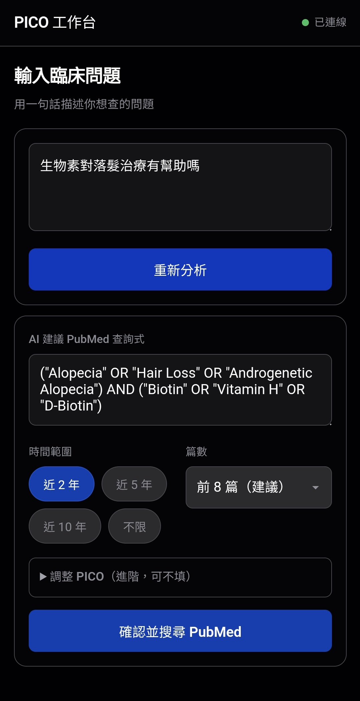
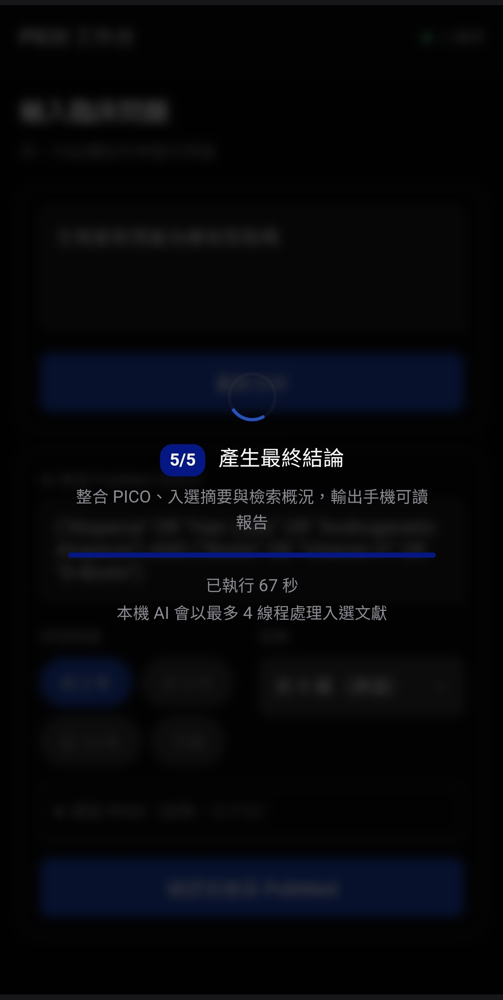
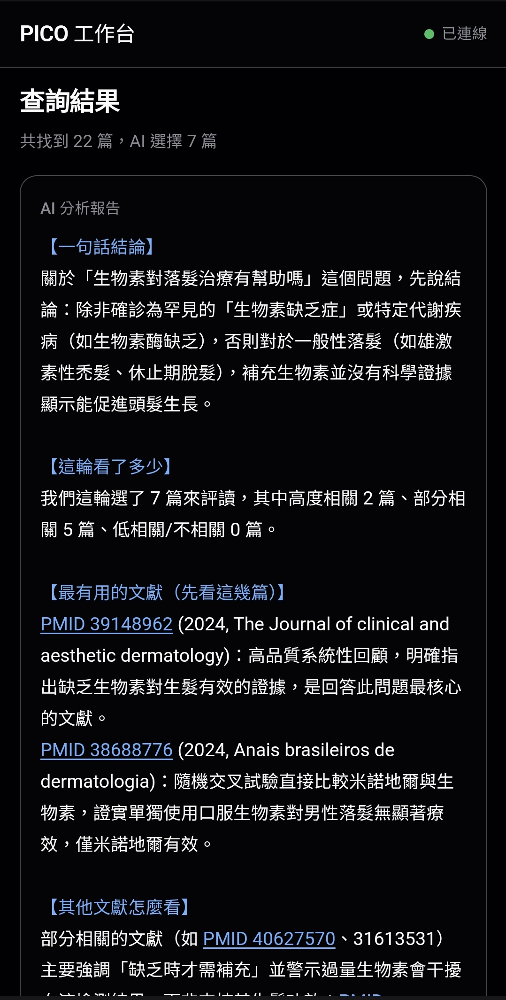

# Clinical PICO Workbench

[English](README.en.md)

手機優先的臨床文獻快速查證工具。輸入一句臨床問題，系統會協助整理 PubMed 查詢式、搜尋文獻、初步篩選、抓取摘要，最後產生繁體中文重點報告。

這個專案主打 **本地可跑**：前端是零依賴 vanilla JS，後端只用 Python 標準庫，文獻來源走 PubMed E-utilities，LLM 可接 LM Studio、OpenRouter，或其他 OpenAI-compatible endpoint。

目前 M2 區網部署與開機自啟設定記錄在 [docs/m2-deployment.md](docs/m2-deployment.md)。

## Demo

範例問題：**「生物素對落髮治療有幫助嗎？」**

<p>
  
  
  
</p>

## 適合誰？

這不是完整系統性回顧工具，而是快速把健康問題拉回 PubMed 證據的第一步。

### 醫療人員

- 快速把臨床問題轉成 PubMed 查詢式。
- 先看近期文獻和 PMID，判斷一個說法值不值得深入查。
- 適合門診前快速準備、衛教內容初步查證、迷思破解、或建立下一輪檢索方向。

### 一般民眾

- 用白話輸入健康問題，不需要先會 PubMed 語法。
- 初步了解某個保健品、治療、網路說法是否有 PubMed 文獻支持。
- 匯出 Markdown，方便帶去和醫師、藥師、營養師或其他專業人員討論。

## 為什麼不是直接 Google？

Google 很適合找入口，但醫療問題常會遇到 SEO 文章、商業內容、片段引用或過度簡化的答案。Clinical PICO Workbench 的做法是：

- 從 PubMed 出發，減少一般網頁雜訊。
- 保留 PMID 和文獻連結，方便回頭看原始資料。
- 明確列出這輪查了什麼、選了哪些文獻、看了多少篇。
- 先給一個可讀的初步結論，而不是只丟一串搜尋結果。

它適合做 **快速驗證、迷思破解、第一輪 evidence triage**。如果問題會影響臨床決策、用藥、治療選擇，或牽涉高風險情境，仍然建議看原文、查 guideline，並做更完整的深度研究。

## 功能特色

- 手機優先流程，適合在手機上快速查證。
- 本地優先，可用 LM Studio 在自己的電腦跑。
- 沒有本地模型也可改用 OpenRouter。
- PubMed 搜尋、摘要抓取、AI 標題初篩、逐篇重點整理。
- PubMed request 全域節流，`efetch` 每批最多 4 個 PMID。
- 預設只看前 8 篇，降低本地 AI 負擔。
- 搜尋結果過少或 0 篇時會提示放寬年份或查詢條件。
- 可匯出 Markdown 報告。
- 前端無 build step，後端無 Python 套件依賴。

## 前置需求

1. **LLM endpoint**
   - 本地：啟動 LM Studio，並開啟 OpenAI-compatible server，通常是 `http://127.0.0.1:1234/v1`
   - 雲端：使用 OpenRouter 或其他 OpenAI-compatible API

2. **網路連線**
   - PubMed E-utilities 需要外網連線。

## 快速啟動

```bash
python3 server.py --host 0.0.0.0 --port 9999
```

同一台電腦開啟：

```text
http://127.0.0.1:9999
```

手機和電腦在同一個 Wi-Fi 時，手機開啟：

```text
http://<你的電腦區網 IP>:9999
```

macOS 也可以直接雙擊：

- `start_clinical_pico.command`
- `stop_clinical_pico.command`

啟動腳本會開瀏覽器，並在啟動後自動關閉自己的 Terminal 啟動器視窗。

## LLM 設定

可以複製 `.env.example`：

```bash
cp .env.example .env
```

也可以啟動時直接帶環境變數。

### LM Studio

```bash
LLM_BASE_URL=http://127.0.0.1:1234/v1 \
LLM_MODEL=your-local-model-name \
python3 server.py --host 0.0.0.0
```

### OpenRouter

```bash
LLM_BASE_URL=https://openrouter.ai/api/v1 \
LLM_MODEL=google/gemini-2.5-flash-lite \
LLM_API_KEY=sk-or-v1-... \
python3 server.py --host 0.0.0.0
```

## 環境變數

| 變數 | 預設值 | 說明 |
|---|---|---|
| `LLM_BASE_URL` | `http://127.0.0.1:1234/v1` | OpenAI-compatible API base URL |
| `LLM_MODEL` | `local-model` | 模型名稱 |
| `LLM_API_KEY` | 空 | OpenRouter 或雲端 endpoint API key |
| `APP_PORT` | `9999` | 服務 port |
| `PUBMED_API_KEY` | 空 | PubMed API key，選填 |
| `PUBMED_EMAIL` | 空 | NCBI 建議提供的聯絡信箱 |
| `NCBI_MIN_INTERVAL_NO_KEY` | `0.38` | 無 PubMed API key 時，每次 NCBI request 至少間隔秒數 |
| `NCBI_MIN_INTERVAL_WITH_KEY` | `0.12` | 有 PubMed API key 時，每次 NCBI request 至少間隔秒數 |

## 手機操作流程

```text
Step 1: 輸入臨床問題
Step 2: AI 產生 PubMed 查詢式，可調整年份和篇數
Step 3: 搜尋 PubMed，AI 先看標題做初篩
Step 4: 抓取入選摘要，逐篇整理重點
Step 5: 產生最終繁中報告，可匯出 Markdown
```

## API 端點

| 方法 | 路徑 | 說明 |
|---|---|---|
| GET | `/api/health` | 健康檢查，包含 LLM 連線狀態 |
| POST | `/api/openrouter/analyze` | 問題分析與 PubMed 查詢式 |
| POST | `/api/pubmed/search` | PubMed 搜尋 |
| POST | `/api/pubmed/abstracts` | 摘要抓取 |
| POST | `/api/openrouter/suggest-selection` | AI 標題初篩 |
| POST | `/api/openrouter/summarize-abstracts` | 逐篇摘要 |
| POST | `/api/openrouter/final-review` | 最終報告 |
| POST | `/api/openrouter/query-optimizer` | 下一輪查詢建議 |
| POST | `/api/openrouter/translate-title` | 標題翻譯 |

## 技術架構

- **前端**：零依賴 vanilla JS + CSS
- **後端**：Python 標準庫 `http.server`
- **LLM**：LM Studio / OpenRouter / 任何 OpenAI-compatible API
- **文獻**：PubMed E-utilities
- **持久化**：瀏覽器 `localStorage`

## 控制中心

- `control_center.command`：單一入口選單
- `status_services.command`：掃描服務狀態
- `recover_services.command`：自動修復服務

## 注意事項

- 本地 LLM 使用者需要先啟動 LM Studio 或其他 OpenAI-compatible server。
- PubMed E-utilities 無 API key 時建議不超過 3 requests/sec；本專案會做全域節流，且摘要 `efetch` 每批最多 4 個 PMID。
- 手機 Safari 地址列收合時 `100dvh` 可能跳動，介面已做手機端處理。
- 這是原型工具，不是醫療建議。重要結論請回到原文、臨床指引和專業判斷。
